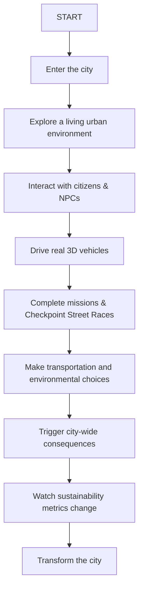

<div align="center">

# 🌍 ECOCITY

### Java-Powered 3D Sustainable Smart City Simulation

**Explore. Decide. Drive. Impact the City.**

[](https://www.oracle.com/java/)
[](https://jmonkeyengine.org/)
[](https://github.com/jMonkeyEngine/jmonkeyengine)
[](https://gradle.org/)
[](LICENSE)


</div>

> Imagine a city where every journey, every vehicle, every infrastructure decision, and every mission changes the environment around you.

ECOCITY turns sustainability from a static concept into an interactive, playable 3D urban simulation.

---

### 💡 Value Proposition

> **ECOCITY transforms sustainable urban development into an interactive 3D gameplay experience powered by Java.**

---

## 📊 Project Snapshot

| Category | Technology / Implementation |
| :--- | :--- |
| **Core Language** | Java 21 |
| **Game Engine** | jMonkeyEngine 3.6 |
| **Rendering** | Real-time 3D PBR Lighting & Materials |
| **Physics** | Bullet Physics (`jme3-bullet-native`) |
| **Assets** | GLB / glTF / Blender 5.2 Processed |
| **Build System** | Gradle Wrapper |
| **Gameplay** | Third-person open-world action simulation |
| **AI** | NPC state-based behaviors & traffic control |
| **Simulation** | Sustainability & environmental metrics |
| **Environment** | Modular 3D smart city district |
| **Platform** | Windows / Linux / macOS |
| **Project Type** | Codeathon prototype |

---

## 🎮 The Experience



---

## ❓ Why ECOCITY?

Traditional sustainability projects often present static charts, dashboards, and complex data tables.

**ECOCITY asks:**
> *What if people could actually experience the consequences of urban decisions in real-time?*

ECOCITY bridges education, engineering, and gameplay by combining:
- **Visual Learning:** Immediate 3D visual feedback on urban decisions.
- **Interactive Experimentation:** Drive electric supercars, navigate smart traffic grid systems, and complete urban missions.
- **Systems Thinking:** Understand the ripple effect of emissions, traffic density, and clean energy adoption.

---

## 🌱 Sustainability & UN SDGs

ECOCITY aligns with the United Nations Sustainable Development Goals by converting sustainability metrics into core gameplay mechanics:

### ⚡ SDG 7 — Affordable and Clean Energy
- **Gameplay Implementation:** Renewable energy adoption, electric vehicle charging stations, and smart energy infrastructure optimization.

### 🏙️ SDG 11 — Sustainable Cities and Communities
- **Gameplay Implementation:** Smart transportation routing, traffic density reduction, public transit integration, and green space coverage.

### 🔄 SDG 12 — Responsible Consumption and Production
- **Gameplay Implementation:** Waste collection logistics, city recycling score tracking, and efficient resource allocation.

### 🌡️ SDG 13 — Climate Action
- **Gameplay Implementation:** Real-time CO2 emission simulation, vehicular air-quality impact, and dynamic environmental scoring.

---

## 🌎 A City That Responds to You

The city environment in ECOCITY is not a static backdrop. Player behavior dynamically impacts the urban simulation:

$$\text{PLAYER ACTION} \longrightarrow \text{SIMULATION ENGINE} \longrightarrow \text{CITY RESPONSE} \longrightarrow \text{VISIBLE CONSEQUENCE}$$

- **Heavy Fossil-Fuel Vehicle Usage** $\rightarrow$ Higher emissions $\rightarrow$ Poorer air quality index $\rightarrow$ Lower overall sustainability score.
- **EV & Public Transport Usage** $\rightarrow$ Reduced urban emissions $\rightarrow$ Cleaner air quality $\rightarrow$ Increased city sustainability rank.

---

## 📈 Sustainability Scorecard Interface

```text
╔══════════════════════════════╗
║        ECOCITY SCORE         ║
╠══════════════════════════════╣
║ Sustainability       82/100  ║
║ Air Quality          84      ║
║ Clean Energy         76      ║
║ Green Coverage       81      ║
║ Recycling            89      ║
║ Traffic               67     ║
╚══════════════════════════════╝
```

*Note: The scoring model updates dynamically based on the current simulation state.*

---

## 🕹️ Feature Matrix

| Feature | Status | Description |
| :--- | :---: | :--- |
| **Real 3D City District** | ✅ | Modular urban environment with custom Blender 5.2 PBR materials |
| **Third-Person Player** | ✅ | Physics capsule character controller with skeletal animations |
| **Cyber Supercar Physics** | ✅ | Realistic AWD driving physics, ground collision, and power drifting |
| **Street Race Checkpoints** | ✅ | 8 glowing neon checkpoint rings, countdown timer & leaderboards |
| **2D Radar Mini-Map** | ✅ | Real-time HUD overlay tracking player, vehicles, and race targets |
| **NPC AI Citizens** | ✅ | State-based pedestrian behaviors and 1:1 scale matching |
| **Police Pursuit System** | ✅ | Dynamic wanted level pursuit and patrol AI |
| **Sustainability Metrics** | 🧪 | Real-time environmental impact calculations |
| **Day / Night Lighting** | 🚧 | Dynamic sun position & skybox transition |
| **Smart Traffic System** | 🚧 | Autonomous vehicle AI driving along street lanes |
| **Save / Load System** | 🚧 | Persistent player progress and high-score recording |

*Legend: ✅ Completed | 🚧 In Development | 🧪 Experimental | 📋 Planned*

---

## 🚗 Gameplay Showcase: Mission GETAWAY

1. **Meet NPC Contact:** Interact with city citizens on foot.
2. **Accept Mission:** Receive urban delivery objectives.
3. **Reach Vehicle:** Locate the cyber supercar on the street grid.
4. **Drive Across District:** Navigate through street lanes while avoiding collisions.
5. **Trigger Police Response:** Handle dynamic wanted-level enforcement.
6. **Navigate Traffic:** Utilize smart routing through urban corridors.
7. **Escape Pursuit:** Outmaneuver police patrols.
8. **Reach Safe Zone:** Complete the objective checkpoint.
9. **Receive Score:** Review environmental and mission performance metrics.

---

## 🏙️ Asset Pipeline & Workflow

ECOCITY utilizes real 3D assets rather than primitive placeholder geometry:

$$\text{ONLINE SOURCE} \rightarrow \text{LICENSE CHECK} \rightarrow \text{BLENDER 5.2 PIPELINE} \rightarrow \text{GLB/glTF CONVERSION} \rightarrow \text{jMonkeyEngine}$$

*All externally sourced 3D assets are tracked with attribution in `assets/sources.md`.*

---

## 🛠️ Technology Stack

| Technology | Role |
| :--- | :--- |
| **Java 21** | Primary programming language & application logic |
| **jMonkeyEngine 3.6** | 3D graphics rendering, scene graph, and game loop engine |
| **Bullet Physics** | Rigid-body simulation and character physics controller |
| **Gradle** | Dependency management and automated build system |
| **Blender 5.2** | Headless 3D model orientation, scaling, and animation baking |

---

## 🏗️ Architecture Overview

```text
                                  ECOCITY
                                     |
         +---------------------------+---------------------------+
         |                           |                           |
       WORLD                      GAMEPLAY                   SIMULATION
         |                           |                           |
  City Loader (PBR)          Player Controller          Sustainability Metrics
  Spawn Manager              Vehicle Physics            CO2 & Air Quality
  Day/Night System           NPC & Police AI            Clean Energy Score
  2D Radar Mini-Map          Street Race Manager        Traffic Density
         |                           |                           |
         +---------------------------+---------------------------+
                                     |
                               jMonkeyEngine
                                     |
                                  Java 21
```

### Module Structure
- `core`: Application entrypoint (`GameApplication.java`) and global config (`GameConfig.java`).
- `world`: PBR city loader (`CityLoader.java`) and environmental lighting.
- `vehicles`: Bullet vehicle physics (`Vehicle.java`) and controller (`VehicleController.java`).
- `mission`: Checkpoint race manager (`StreetRaceManager.java`) and quest system.
- `ui`: HUD (`HUD.java`) and 2D radar overlay (`MiniMap.java`).
- `player`: Character controller (`Player.java`) and camera system (`ThirdPersonCamera.java`).

---

## ⚡ Quick Start

### Requirements
- **JDK 17+** (JDK 21 recommended)
- **Git**
- **Gradle 8+** (Gradle Wrapper included)

### Running on Windows (PowerShell)
```powershell
.\gradlew.bat run
```

### Running on Linux / macOS
```bash
./gradlew run
```

---

## ⌨️ Controls

| Key | Action |
| :--- | :--- |
| `W` `A` `S` `D` | Move Character / Drive Vehicle |
| `E` / `F` | Interact / Enter or Exit Vehicle |
| `SPACE` | Jump (On Foot) / Handbrake & Power-Drift (In Vehicle) |
| `Mouse` | Orbit Camera |
| `Scroll Wheel` | Zoom Camera Distance |
| `ESC` | Pause Game Menu |
| `F3` | Toggle Physics Collision Debug Wireframes |

---

## 🚀 Performance Optimization

- **Distance-Based Activation:** Active NPC & vehicle processing scoped to player proximity.
- **Hardware Skinning:** Optimized skeletal mesh animation rendering.
- **Camera Synchronization:** Direct target tracking (`24.0f * tpf`) eliminating physics tick camera shaking.
- **Non-IBL PBR Tuning:** Material metallic parameters tuned (`0.05f - 0.20f`) to prevent black surface reflections without environmental HDRI maps.

---

## 📜 Asset Licensing & Attribution

- Third-party 3D models and assets remain under their respective original licenses (CC-BY / Royalty-Free).
- Full attribution links and creator details are maintained in [`assets/sources.md`](assets/sources.md).

---

## 🏆 Codeathon Value & Engineering Highlights

```text
      JAVA 21
         +
  3D GAME ENGINE
         +
   AI & PHYSICS
         +
SUSTAINABILITY MODEL
```

ECOCITY demonstrates advanced Java object-oriented design, real-time 3D scene-graph management, headless Blender asset automation, and dynamic environmental simulation.

---

## ⏱️ 180-Second Codeathon Demo Guide

1. **0:00 - 0:20 | Introduction:** Showcase the 3D smart city district and third-person character.
2. **0:20 - 0:50 | Exploration:** Walk through city sidewalks and interact with civilian NPCs.
3. **0:50 - 1:30 | Supercar Driving:** Enter the futuristic supercar, demonstrate 55 km/h driving physics, smooth coasting momentum, and 2D radar tracking.
4. **1:30 - 2:30 | Checkpoint Race:** Trigger the Street Race mode, navigating through glowing neon Torus rings across city streets.
5. **2:30 - 3:00 | Sustainability Review:** Review city sustainability scorecard and environmental impact.

---

<div align="center">

> **ECOCITY is not just a city you explore. It is a city that reacts to you.**

**Built with Java. Powered by jMonkeyEngine. Designed for a sustainable future.**

[**View Repository**](https://github.com/kamalesh404/Cyber-City)

</div>
